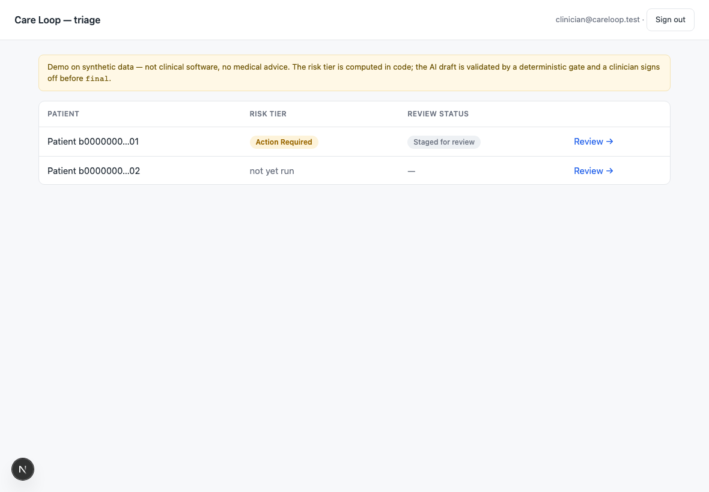
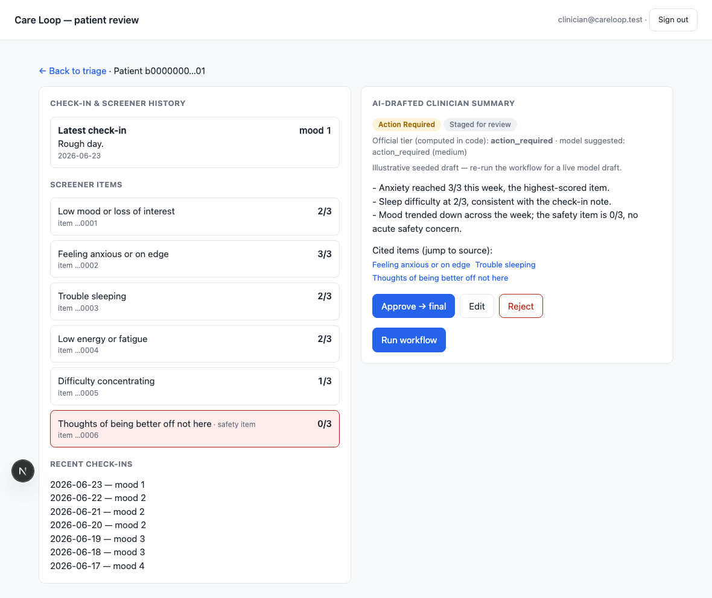

# Care Loop — an agentic behavioral-health workflow demo

A demo I built hands-on in Next.js + TypeScript + React + Supabase (with Row-Level Security and an Edge
Function) to model an agentic behavioral-health workflow: it perceives check-in data, reasons over it with
Claude, drafts a clinician summary, and runs a reflection pass that validates the draft before a human reviews
it. It is **not** clinical software and gives no medical advice — a clinician stays strictly in the loop. Built
AI-native: I own the architecture and directed the implementation.

> **Honest framing.** This models an agentic behavioral-health workflow from a **described engineering role**
> and a reasonable read of how such platforms work — it is **modeled, not insider knowledge** of any company's
> internals. It is a **demo, not clinical software**, and gives no diagnosis or medical advice.

**For reviewers:** the *why* behind every non-obvious decision is in [`docs/adr/`](docs/adr/). The two that
best show the engineering judgment are **[ADR-0004](docs/adr/0004-reflection-gate-is-deterministic.md)** (the
deterministic patient-safety gate — why the model is given no authority over what reaches a clinician) and
**[ADR-0007](docs/adr/0007-shared-core-across-deno-node-boundary.md)** (the Deno/Node runtime boundary — why
one shared source of truth, and why the harder edge-function path was chosen deliberately).

---

## The workflow it models

A deterministic **orchestrator** (a Supabase Edge Function on Deno) runs four phases per check-in. The model
reasons and drafts; **code orchestrates, validates, computes scores, and gates** — the LLM proposes structure,
deterministic code disposes. The function is invoked two ways: **on-demand** from the dashboard, and on a
**daily schedule** that scans new check-ins.

1. **Perception — collect.** Read a patient's submitted check-in (mood + short free-text) plus recent
   standardized-screener scores.
2. **Reasoning — signal detection.** One Claude call (tool use) detects patterns over time and returns a
   **validated structured assessment** (signals, severity, suggested risk, confidence, `needs_manual_review`).
   The model proposes; it sets no official number.
3. **Autonomous action — orchestrate.** Code computes the **official risk tier deterministically**
   (`scoring.ts`); a second Claude call **drafts** a short clinician summary citing specific items; if tier =
   `urgent`, an **alert** is created (a simulated notification — see
   [ADR-0005](docs/adr/0005-scope-boundaries-and-deferred-features.md)).
4. **Reflection — deterministic gate before staging.** Code (not the model) validates the draft against hard
   checks over the **real data** — structural, grounding, must-flag coverage, numeric/risk consistency, banned
   content — and escalates on **data thresholds**. The model's own confidence is escalate-only and has no
   authority. Fail → `needs_manual_review`; pass → `staged_for_review`. **A clinician must sign off before
   `final`.** Every phase writes an `audit_log` event (metadata only).

## Architecture principles

- **The model never does the dangerous thing.** It proposes structured assessments/drafts; deterministic code
  validates (zod) and computes the official risk tier. No model output is rendered as raw HTML or treated as
  authoritative.
- **The reflection gate is deterministic code, not a model self-grade.** The model's confidence flag is
  escalate-only; escalation is a threshold on real data; the human signs off for `final`.
- **Tenant isolation lives in the database (RLS), not the app** — proven by a passing cross-tenant test.
- **Human strictly in the loop.** Nothing reaches `final` without clinician sign-off.
- **Audit logging + no PHI in logs.** Secrets in env only.

## Tech stack

Next.js (App Router) + TypeScript (strict) + React · Supabase (Postgres, Auth, RLS, Edge Functions + a
scheduled trigger) · `@anthropic-ai/sdk` (tool use + structured output) · `zod` · Vitest (unit tests + eval) ·
GitHub Actions CI · Tailwind (minimal). Deploy: Vercel (optional).

---

## Build status

This repo is being built in phases, one reviewable concern per pull request. The decision records come first so
the code that follows can reference a settled rationale.

- [x] **Phase 0 — Decision records.** Eight ADRs in [`docs/adr/`](docs/adr/) + this README.
- [x] **Phase 1 — Scaffold + shared core.** Next.js (strict TS) app; the framework-free core
  ([`schema.ts`](src/lib/shared/schema.ts) / [`scoring.ts`](src/lib/shared/scoring.ts) /
  [`reflect.ts`](src/lib/shared/reflect.ts)) with thresholds in [`config/thresholds.ts`](config/thresholds.ts);
  Vitest unit tests including the four reflect cases (hallucinated id, dropped critical item, number/risk
  mismatch, "model confident but blocked").
- [x] **Phase 2 — Database.** Migrations, RLS on every org-scoped table, seed, and a passing cross-tenant test.
- [x] **Phase 3 — Edge function orchestrator.** The four-phase Deno function
  ([`run-workflow`](supabase/functions/run-workflow/index.ts)) importing the shared core unchanged via a
  `deno.json` import map (ADR-0007); the pure pipeline ([`orchestrator.ts`](src/lib/shared/orchestrator.ts))
  with a dependency-injected model client — stub in tests, real Anthropic at the boundary (ADR-0009); auth
  posture per ADR-0006.
- [x] **Phase 4 — Dashboard + patient review UI.** Clinician triage list (RLS-scoped, risk-ordered) and a
  dual-pane review with cited-item links and clinician sign-off; "Run workflow" invokes the edge function.
- [ ] **Phase 5 — Eval harness + CI.**

## Screenshots

> Synthetic demo data — no real PHI.

**Triage dashboard** (RLS-scoped, ordered by risk tier):



**Dual-pane review** — raw check-in + screener history on the left; the AI draft (validated by the
deterministic gate) with cited-item links and clinician sign-off on the right:



## Getting started

```bash
npm install
npm test             # Vitest: scoring + reflect + schema (+ RLS when a stack is up)
npm run typecheck    # tsc --noEmit (strict)
npm run lint         # eslint
```

Run the full app against a local Supabase stack (Docker required):

```bash
npx supabase start                       # boots Postgres + Auth, applies migrations + seed
# copy the printed API URL + anon + service_role keys into .env.local:
#   NEXT_PUBLIC_SUPABASE_URL=...  NEXT_PUBLIC_SUPABASE_ANON_KEY=...  SUPABASE_SERVICE_ROLE_KEY=...
npx supabase functions serve run-workflow   # serve the edge function (separate terminal)
npm run dev                              # http://localhost:3000
# sign in as the seeded clinician: clinician@careloop.test / demo-password
```

For a live "Run workflow" call, set the model secret (never commit it; `.env.example` keeps a placeholder):

```bash
echo "ANTHROPIC_API_KEY=sk-ant-..." >> .env.local
npx supabase secrets set ANTHROPIC_API_KEY=sk-ant-...
```
